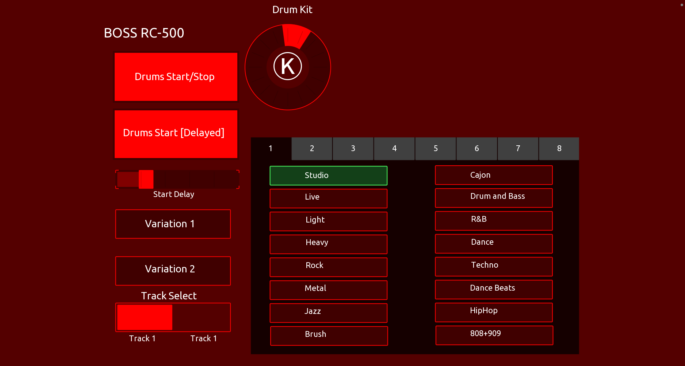

# TouchOSC_BossRC500
This repository includes TouchOSC templates for the Boss RC-500

This work is heavily inspired by the work David Shanhun did [here](https://www.youtube.com/watch?v=DHOD1wRqrK8&t=1004s). In his instance
he has an RC-600, I have an RC-500 looper pedal, so I decided to create this.

## Working features:
* Drum Start/Stop
* Delayed Drums Start/Stop
* Start Delay Selection (0.5 - 5 seconds, default 1)
* Variation 1
* Variation 2
* Drum Kit selection by encoder
* Drum Kit selection by buttons in pager group
* Drum Pattern selection by buttons in pager group
* Highlight of selected drumkit
* Highlight of selected drum pattern
* Update of drum kit encoder when kit is selected via button.
* Color updates of drum start/stop and delay as a group

## Features being developed:
* Track Select (may, may not work)
* Migration of Drum start/stop from current MIDI setting to the start/stop toggle, to free up another one of the 8 assigns.
* Improvements to the LUA scripting in use
* Time signature

## Features not under consideration:
* Tempo, tap-tempo, etc. - I'm using my DAW as a MIDI clock source

The interface is under heavy development and will change frequently

## MIDI Assignments on Boss RC-500

I am using the following assignments for MIDI on the Boss-RC500. 

Channel | Assignment Number | Action | CC# 
| :--- | ---: | :---: | :---:
9  | 1 | Rhythm Play | 23
9  | 2 |Rhythm Stop | 24
9  | 3 |Drum Kit | 25
9  | 4 |Drum Pattern | 26
9  | 5 |Variation| 27
9  | 6 |Track | 28
9  | 7 |Unassigned | 23
9  | 8 |Unassigned | 23

